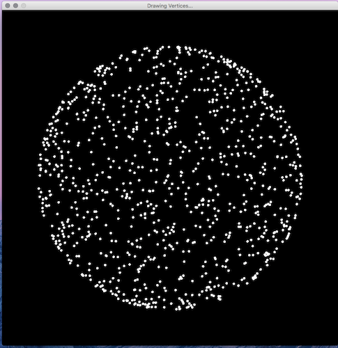
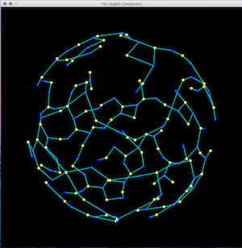

# Wireless Sensor Network Simulator

This simulation is able to distribute nodes on the surfaces of multiple shapes - representing different network topologies.

It can even connect these nodes given some calculated distance.

From there, the program has the ability to “color” each node based off its neighbors.

Finally, the program can display the two largest backbones of the graph, i.e. the structures that connect the largest amount of nodes on the network.

The program supports spheres, disks, and squares.

For a more detailed explanation of this program including performance statistics and a reduction to practice, please see Smith_WSN.pdf.
Please read it. It took me forever to write.

## How to Run:

Navigate to the Executables/ folder and then to the correct application folder for your operating system and run the executable!

## Controls:
* Press space to navigate through the different steps.
* Up/down arrows to zoom
* Mouse to drag 

## Changing variables:

If you would like to change the type of graph being displayed, you may do so on lines 4-6 of Java-WirelessSensorNetwork.pde

Please see "How to Compile" below.

## How to Compile:
1. Download [Processing 3](https://processing.org/download/) 
2. Open Java_WirelessSensorNetwork.pde
3. Click run :)

..

